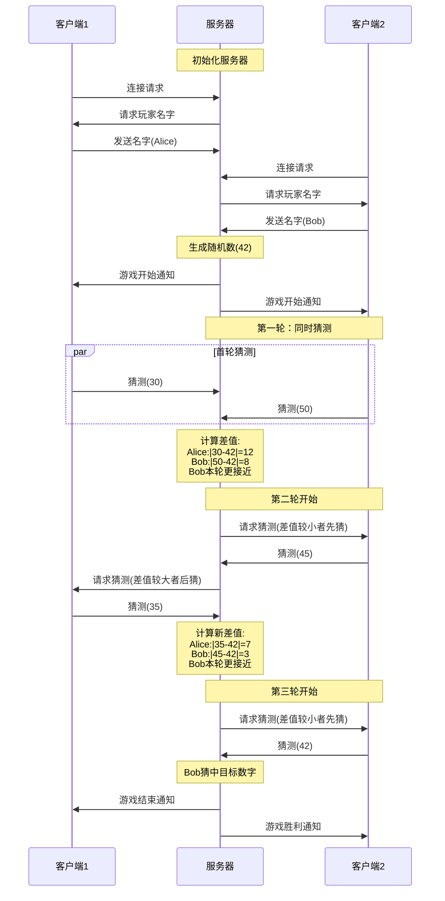

```mermaid
sequenceDiagram
    participant C1 as 客户端1
    participant S as 服务器
    participant C2 as 客户端2

    Note over S: 初始化服务器

    C1->>S: 连接请求
    S->>C1: 请求玩家名字
    C1->>S: 发送名字(Alice)
    
    C2->>S: 连接请求
    S->>C2: 请求玩家名字
    C2->>S: 发送名字(Bob)

    Note over S: 生成随机数(42)
    
    S->>C1: 游戏开始通知
    S->>C2: 游戏开始通知

    Note over S,C2: 第一轮：同时猜测
    par 首轮猜测
        C1->>S: 猜测(30)
        C2->>S: 猜测(50)
    end

    Note over S: 计算差值:<br/>Alice:|30-42|=12<br/>Bob:|50-42|=8<br/>Bob本轮更接近

    Note over S,C2: 第二轮开始
    S->>C2: 请求猜测(差值较小者先猜)
    C2->>S: 猜测(45)

    S->>C1: 请求猜测(差值较大者后猜)
    C1->>S: 猜测(35)
    
    Note over S: 计算新差值:<br/>Alice:|35-42|=7<br/>Bob:|45-42|=3<br/>Bob本轮更接近

    Note over S,C2: 第三轮开始
    S->>C2: 请求猜测(差值较小者先猜)
    C2->>S: 猜测(42)

    Note over S: Bob猜中目标数字
    
    S->>C1: 游戏结束通知
    S->>C2: 游戏胜利通知
```