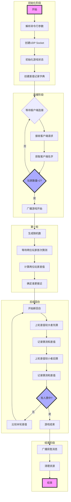
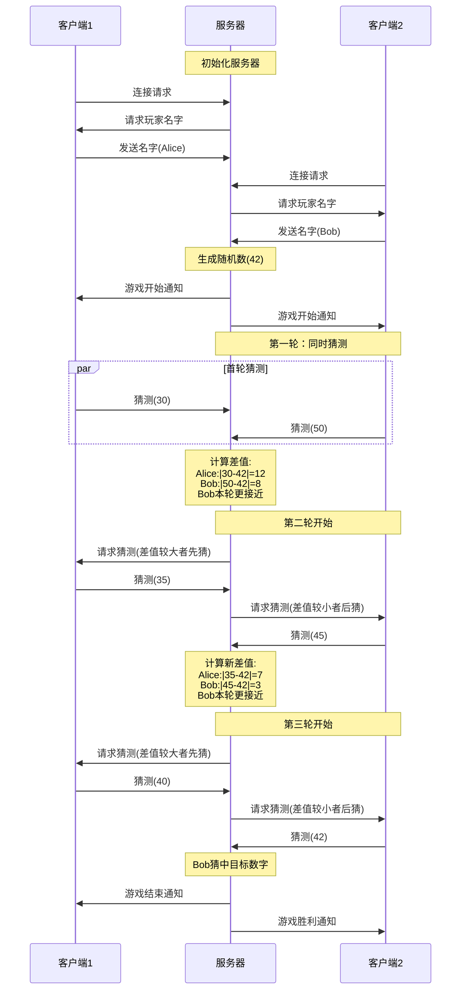

# Session3

## 序列图

```mermaid
graph TB
    subgraph "初始化阶段"
        A[开始] --> B[解析命令行参数]
        B --> C[创建UDP Socket]
        C --> D[初始化游戏状态]
        D --> E[创建差值记录字典]
    end

    subgraph "连接阶段"
        E --> F{等待客户端连接}
        F --> G[接收客户端请求]
        G --> H[获取客户端名字]
        H --> I{玩家数量=2?}
        I -->|否| F
        I -->|是| J[广播游戏开始]
    end

    subgraph "第一轮"
        J --> K[生成随机数]
        K --> L[等待两位玩家首次猜测]
        L --> M[计算两位玩家差值]
        M --> N[确定谁更接近]
    end

    subgraph "后续回合"
        N --> O[开始新回合]
        O --> P[上轮差值较大者先猜]
        P --> Q[记录猜测和差值]
        Q --> R[上轮差值较小者后猜]
        R --> S[记录猜测和差值]
        S --> T{有人猜中?}
        T -->|否| U[比较本轮差值]
        U --> O
        T -->|是| V[游戏结束]
    end

    subgraph "结束阶段"
        V --> W[广播获胜消息]
        W --> X[清理资源]
        X --> Y[结束]
    end

    style A fill:#f9f,stroke:#333,stroke-width:4px
    style Y fill:#f9f,stroke:#333,stroke-width:4px
    style T fill:#aaf,stroke:#333,stroke-width:4px
    style I fill:#aaf,stroke:#333,stroke-width:4px
```

## 序列图

```mermaid
sequenceDiagram
    participant C1 as 客户端1
    participant S as 服务器
    participant C2 as 客户端2

    Note over S: 初始化服务器

    C1->>S: 连接请求
    S->>C1: 请求玩家名字
    C1->>S: 发送名字(Alice)
    
    C2->>S: 连接请求
    S->>C2: 请求玩家名字
    C2->>S: 发送名字(Bob)

    Note over S: 生成随机数(42)
    
    S->>C1: 游戏开始通知
    S->>C2: 游戏开始通知

    Note over S,C2: 第一轮：同时猜测
    par 首轮猜测
        C1->>S: 猜测(30)
        C2->>S: 猜测(50)
    end

    Note over S: 计算差值:<br/>Alice:|30-42|=12<br/>Bob:|50-42|=8<br/>Bob本轮更接近

    Note over S,C2: 第二轮开始
    S->>C1: 请求猜测(差值较大者先猜)
    C1->>S: 猜测(35)
    
    S->>C2: 请求猜测(差值较小者后猜)
    C2->>S: 猜测(45)

    Note over S: 计算新差值:<br/>Alice:|35-42|=7<br/>Bob:|45-42|=3<br/>Bob本轮更接近

    Note over S,C2: 第三轮开始
    S->>C1: 请求猜测(差值较大者先猜)
    C1->>S: 猜测(40)
    
    S->>C2: 请求猜测(差值较小者后猜)
    C2->>S: 猜测(42)

    Note over S: Bob猜中目标数字

    S->>C1: 游戏结束通知
    S->>C2: 游戏胜利通知
```